# Almacenamiento en la Nube, Comparativa de Bibliotecas y Hadoop MapReduce

## 1. Almacenamiento en la Nube (GCS)

El dataset se almacena en un bucket de Google Cloud Storage
(`gs://bank-segmentation-bigdata-data`, región `us-central1`, acceso
uniforme a nivel de bucket), organizado en dos prefijos: `raw/` contiene el
archivo original (67.564.190 bytes, 1.048.567 filas) y `processed/` los
resultados de las consultas, separados por biblioteca
(`processed/polars/`, `processed/dask/`, `processed/modin/`,
`processed/pyspark/`, 10 archivos cada uno).

Usar almacenamiento en la nube permite mantener el dataset disponible y
durable fuera de una sola máquina, que los procesos de Dataproc/Spark lo
lean directamente sin necesidad de subirlo de nuevo, y separar los datos
crudos (`raw/`) de los datos procesados (`processed/`) mediante prefijos
dentro de un mismo bucket.

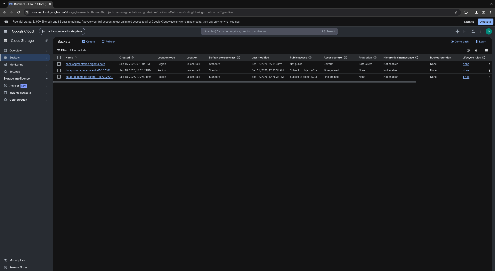

Evidencia de la creación del bucket y su contenido:

```
$ gcloud storage buckets describe gs://bank-segmentation-bigdata-data
creation_time: 2026-09-16T23:21:04+0000
default_storage_class: STANDARD
location: US-CENTRAL1
name: bank-segmentation-bigdata-data
storage_url: gs://bank-segmentation-bigdata-data/
uniform_bucket_level_access: true

$ gcloud storage ls -l gs://bank-segmentation-bigdata-data/raw/
  67564190  2026-09-16T23:21:26Z  gs://bank-segmentation-bigdata-data/raw/bank_transactions.csv
TOTAL: 1 objects, 67564190 bytes (64.43MiB)

$ gcloud storage ls gs://bank-segmentation-bigdata-data/processed/
gs://bank-segmentation-bigdata-data/processed/dask/
gs://bank-segmentation-bigdata-data/processed/modin/
gs://bank-segmentation-bigdata-data/processed/polars/
gs://bank-segmentation-bigdata-data/processed/pyspark/
```

Los 40 archivos de `processed/` (10 consultas por cada una de las 4
bibliotecas) fueron generados por los notebooks ejecutados en el clúster de
Dataproc, que leen el dataset desde `raw/` y escriben sus resultados de
vuelta al bucket.

Junto al bucket del proyecto aparecen dos buckets adicionales,
`dataproc-staging-us-central1-...` y `dataproc-temp-us-central1-...`. Estos
son creados automáticamente por Dataproc al aprovisionar un clúster: el
bucket de *staging* almacena los archivos de configuración, dependencias y
metadatos de control de los trabajos enviados al clúster, mientras que el
bucket *temp* guarda datos temporales generados durante la ejecución. Ambos
persisten después de eliminar el clúster, ya que Dataproc los reutiliza en
clústeres posteriores de la misma región, y su contenido (aproximadamente
6 MB en conjunto) no forma parte del data lake del proyecto: el dataset
reside únicamente en `gs://bank-segmentation-bigdata-data`.

## 2. Arquitectura

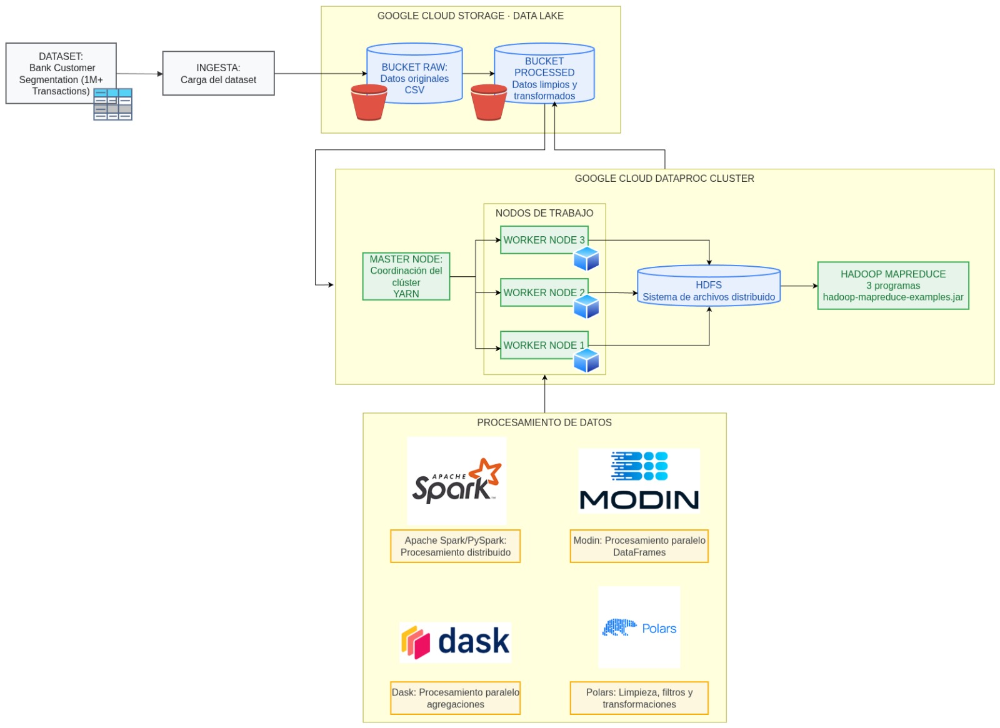

La arquitectura se compone de cuatro bloques. La **fuente de datos** es el
dataset Bank Customer Segmentation. Su incorporación se realiza mediante
**ingesta por lotes (batch)**, es decir, cargas masivas del conjunto
completo en momentos puntuales, en contraposición a una ingesta en
streaming, donde los registros llegarían de forma continua a medida que se
generan. Se optó por el modelo batch porque el dataset es histórico y
estático: corresponde a transacciones ya ocurridas, no a un flujo en vivo,
por lo que basta con una única carga del archivo CSV al data lake. El
**data lake** en Google Cloud
Storage separa los datos originales (`raw/`) de los datos limpios y
transformados (`processed/`). El **procesamiento distribuido** se realiza
sobre un clúster de Dataproc, donde el nodo maestro coordina los recursos
mediante YARN y los nodos worker ejecutan las tareas, usando HDFS como
sistema de archivos distribuido tanto para la entrada como para la salida
de los programas de Hadoop MapReduce. Las cuatro bibliotecas de
procesamiento (Polars, Dask, Modin y PySpark) operan sobre estos datos,
leyéndolos directamente desde el bucket.

## 3. Comparativa de Bibliotecas: Local, Nube y Nube Distribuida

### 3.1 Metodología

Se ejecutaron dos mediciones independientes en Polars, Dask, Modin y
PySpark:

- **`read_csv`**: lectura completa del archivo, forzando la materialización
  de los datos. Aísla el costo de acceso al dato, que es lo que distingue
  al entorno local (disco) del de nube (red).
- **`control_groupby_location`**: la consulta completa — filtrar
  `TransactionAmount > 0`, agrupar por `CustLocation`, calcular
  conteo/suma/promedio y ordenar.

Ambas se midieron por separado porque Dask y PySpark evalúan de forma
perezosa: en ellos la lectura no ocurre al invocar `read_csv`, sino al
materializar el resultado, por lo que descomponer la consulta en fases
dentro de una misma ejecución no daría valores representativos.

Cada combinación de biblioteca, entorno y medición se repitió **5 veces**,
reportándose la media y la desviación estándar. Las métricas registradas
por ejecución son:

- **Tiempo de ejecución** (wall-clock).
- **Tiempo de CPU** (usuario + sistema). Su relación con el tiempo de
  ejecución indica si el proceso estuvo calculando o esperando: un tiempo
  de CPU muy superior al wall-clock implica paralelismo efectivo entre
  núcleos, mientras que uno muy inferior implica espera por E/S.
- **Memoria pico (RSS)**, muestreada cada 5ms sobre el proceso y sus
  procesos hijos. Incluir los hijos es necesario porque PySpark ejecuta el
  trabajo real en una JVM independiente: medir solo el proceso de Python
  reportaría únicamente el contenedor liviano que la invoca.
- **Bytes recibidos por red** durante el bloque medido.

Se compararon tres entornos:

- **Local**: laptop personal (Asus ROG Strix G18), leyendo el CSV desde
  disco local.
- **Nube**: una máquina virtual de Dataproc (`e2-standard-4`, 4 vCPU/16GB),
  leyendo el mismo CSV directamente desde el bucket (`gs://...`), con el
  mismo código, en un solo proceso (PySpark en modo `local[*]`).
- **Nube distribuida**: la consulta se reparte entre los 2 nodos worker del
  clúster (`e2-standard-2` cada uno). PySpark se ejecuta con
  `--master yarn`, aprovechando la integración nativa de Dataproc con YARN.
  Dask y Modin se ejecutan sobre un clúster Dask levantado manualmente
  sobre los mismos nodos (un scheduler en el nodo maestro y 4 procesos
  worker repartidos entre las dos máquinas). Polars no aparece en este
  entorno porque no dispone de un modo de ejecución distribuida: está
  diseñado para explotar los núcleos de una única máquina.

En el entorno distribuido, la memoria y los bytes de red medidos
corresponden únicamente al proceso driver; el cómputo y la lectura reales
ocurren en los procesos worker de las otras máquinas, por lo que esos
valores no son comparables con los de los otros entornos (véase la sección
de limitaciones). El tiempo de ejecución sí es directamente comparable.

### 3.2 Resultados

Media ± desviación estándar sobre 5 repeticiones por celda (110 mediciones
en total).

**Consulta completa (`control_groupby_location`)**

| Biblioteca | Entorno | Tiempo (s) | CPU (s) | Memoria pico (MB) | Red recibida (MB) |
|---|---|---|---|---|---|
| Polars | Local | 0,08 ± 0,00 | 0,66 | 633 | 0,0 |
| Polars | Nube | 2,00 ± 0,16 | 3,31 | 690 | 72,0 |
| Polars | Nube distribuida | no aplica | — | — | — |
| Dask | Local | 0,91 ± 0,02 | 1,08 | 646 | 1,2 |
| Dask | Nube | 5,05 ± 0,11 | 6,02 | 805 | 72,4 |
| Dask | Nube distribuida | 6,86 ± 2,25 | 4,42 | 232 | 1,6 |
| Modin | Local | 1,86 ± 0,05 | 4,91 | 1323 | 162,3 |
| Modin | Nube | 13,60 ± 0,78 | 35,35 | 1729 | 340,1 |
| Modin | Nube distribuida | 7,65 ± 0,45 | 5,70 | 313 | 119,9 |
| PySpark | Local | 2,47 ± 0,03 | 21,93 | 1264 | 1,0 |
| PySpark | Nube | 24,35 ± 1,32 | 71,97 | 1448 | 149,8 |
| PySpark | Nube distribuida | 35,47 ± 1,72 | 52,15 | 1124 | 2,6 |

**Lectura del archivo (`read_csv`)**

| Biblioteca | Entorno | Tiempo (s) | Red recibida (MB) |
|---|---|---|---|
| Polars | Local | 0,04 ± 0,00 | 0,0 |
| Polars | Nube | 1,90 ± 0,22 | 71,8 |
| Dask | Local | 1,01 ± 0,03 | 0,0 |
| Dask | Nube | 5,37 ± 0,17 | 72,6 |
| Modin | Local | 1,49 ± 0,12 | 116,0 |
| Modin | Nube | 11,37 ± 0,39 | 280,0 |
| PySpark | Local | 1,73 ± 0,03 | 0,0 |
| PySpark | Nube | 17,66 ± 1,50 | 149,5 |

Esta tabla contrasta local frente a nube, que es donde cambia el origen del
dato. El entorno distribuido se omite aquí porque en él la lectura la
ejecutan los workers de las otras máquinas y el contador de red del driver
no la refleja, lo que haría la columna no comparable.

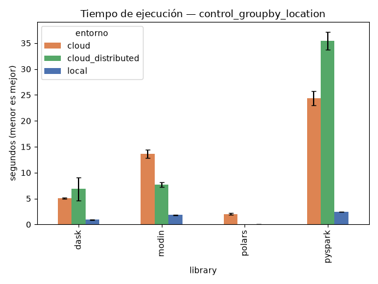
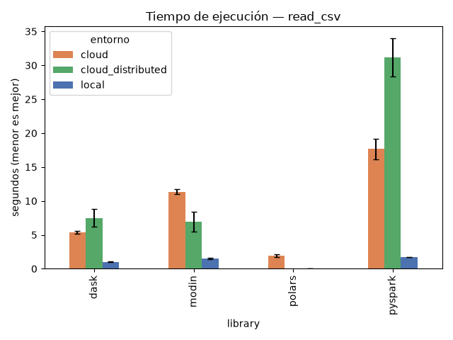
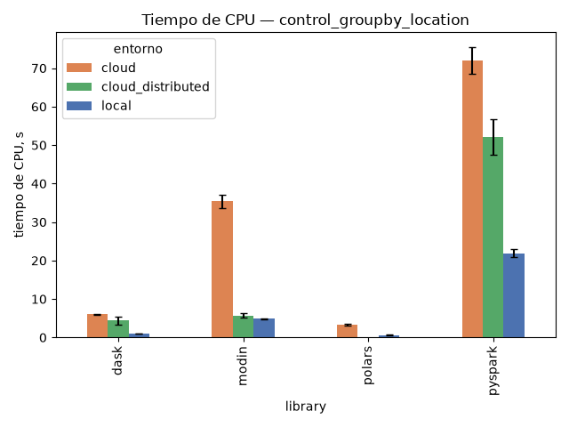
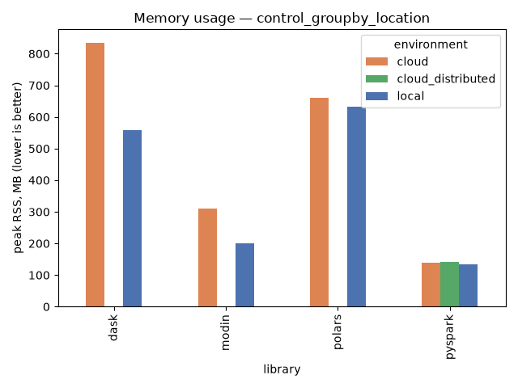

### 3.3 Análisis

**El acceso al dato explica la diferencia entre local y nube.** La medición
de lectura aislada lo confirma de forma directa: en el entorno local el
contador de red registra 0,0 MB (el archivo proviene del disco), mientras
que en la nube registra ~72 MB, que es exactamente el tamaño del CSV
descargado desde el bucket. El costo de esa transferencia domina el tiempo
total: en Polars la lectura (1,90s) representa el 95% de la consulta
completa (2,00s), y en Dask prácticamente la totalidad (5,37s frente a
5,05s, diferencia dentro del margen de variación). Es decir, en la nube el
tiempo no se va en calcular, sino en traer los datos.

**La relación entre tiempo de CPU y tiempo de ejecución refuerza lo
anterior.** En local, Polars consume 0,66s de CPU en 0,08s de ejecución
(factor 8: usa varios núcleos en paralelo) y PySpark 21,93s en 2,47s
(factor 9). En la nube esos factores caen a 1,65 y 2,95 respectivamente:
el proceso pasa la mayor parte del tiempo esperando datos, no calculando.

**El efecto de la distribución no fue uniforme.** PySpark sobre YARN
(35,47s) y Dask sobre el clúster Dask (6,86s) resultaron más lentos que sus
ejecuciones en una sola máquina en la nube (24,35s y 5,05s). Modin, en
cambio, mejoró de 13,60s a 7,65s, siendo la única biblioteca con un
beneficio neto: era la más lenta en un solo proceso, y repartir la carga
entre cuatro procesos worker en dos máquinas compensó parte de esa
penalización. Con ~1M de filas, que caben holgadamente en una sola
máquina, el costo de coordinación (reparto de tareas, traslado de datos
entre nodos para la agrupación) generalmente supera la ganancia de
paralelismo.

**Ninguna configuración en la nube superó a la ejecución local**, ni
siquiera la distribuida. El beneficio del procesamiento distribuido se
manifiesta en volúmenes que exceden la capacidad de una única máquina,
escenario que este caso de prueba no alcanza: la ventaja de Cloud Storage
aquí es la durabilidad y el acceso compartido, no el rendimiento.

**Memoria.** Los valores más altos corresponden a Modin (1323MB en local) y
PySpark (1264MB), frente a Polars (633MB) y Dask (646MB), coherente con que
los dos primeros mantienen infraestructura adicional (un clúster Dask local
y una JVM, respectivamente). En los entornos distribuidos la cifra baja de
forma engañosa (Dask pasa de 805MB a 232MB) porque la medición solo cubre
el proceso driver, mientras el procesamiento real ocurre en los workers de
las otras máquinas.

### 3.4 Limitaciones

- **La memoria en el entorno distribuido no es comparable.** La métrica
  cubre el proceso driver y sus hijos en la máquina donde se lanza, pero no
  los procesos worker de las otras máquinas, que es donde ocurre el
  procesamiento real. Medirla requeriría instrumentar cada worker por
  separado y agregar los picos, con mecanismos distintos para Dask y para
  Spark. Por la misma razón, los bytes de red en ese entorno son bajos: la
  descarga desde el bucket la realizan los workers, no el driver.
- **El contador de red es del sistema, no del proceso**, e incluye tráfico
  de loopback. Esto explica los ~116-162 MB que registra Modin en local
  pese a leer del disco: corresponden a la comunicación interna entre los
  procesos de su clúster Dask local, no a tráfico de red externo.
- **Las ejecuciones locales se benefician de la caché de disco del sistema
  operativo** al repetirse sobre el mismo archivo, ventaja que la máquina
  virtual no tiene en la misma medida. Parte de la diferencia local-nube
  puede atribuirse a este efecto, además de la latencia de red.
- **Las mediciones corresponden a un único tamaño de dataset** (~1M filas,
  64MB). Las conclusiones sobre el costo-beneficio de la distribución
  aplican a ese orden de magnitud y no son extrapolables a volúmenes
  mayores.

## 4. Hadoop MapReduce en Google Cloud Dataproc

Se seleccionaron y ejecutaron tres programas del archivo
`hadoop-mapreduce-examples.jar` (distintos de wordcount y grep) sobre un
clúster de Dataproc compuesto por un nodo maestro (`e2-standard-4`) y dos
nodos worker (`e2-standard-2` cada uno), región `us-central1`. El clúster
se eliminó inmediatamente después de su uso para evitar costos
innecesarios.

Los tres programas se ejecutaron sobre un mismo archivo de entrada,
`locations.txt`, generado a partir de la columna `CustLocation` del
dataset (`bank_transactions.csv`) leído desde el bucket, con un valor por
línea (1.048.567 líneas), almacenado en HDFS. Dado que estos programas
tokenizan por espacios en blanco, los nombres de ciudad compuestos por más
de una palabra (por ejemplo, "NAVI MUMBAI") se cuentan como dos palabras
separadas, resultando en 1.296.123 palabras totales.

Los trabajos se enviaron mediante `gcloud dataproc jobs submit hadoop`, por
lo que quedan registrados en la consola de Dataproc y en el gestor de
recursos YARN.

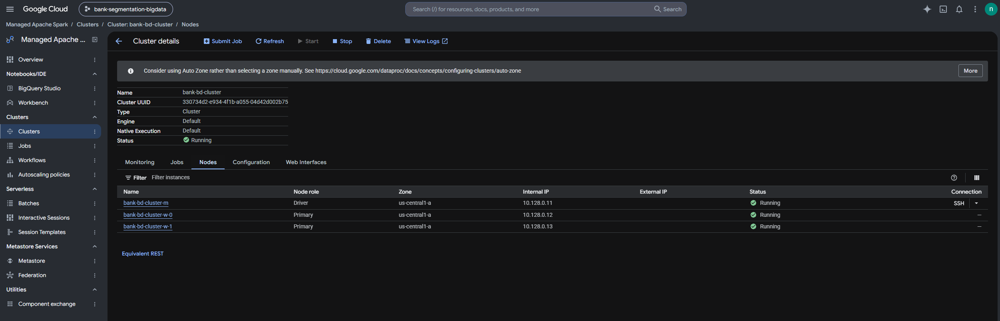

*Clúster `bank-bd-cluster`: nodo maestro (`bank-bd-cluster-m`) y dos nodos
worker (`bank-bd-cluster-w-0`, `bank-bd-cluster-w-1`).*

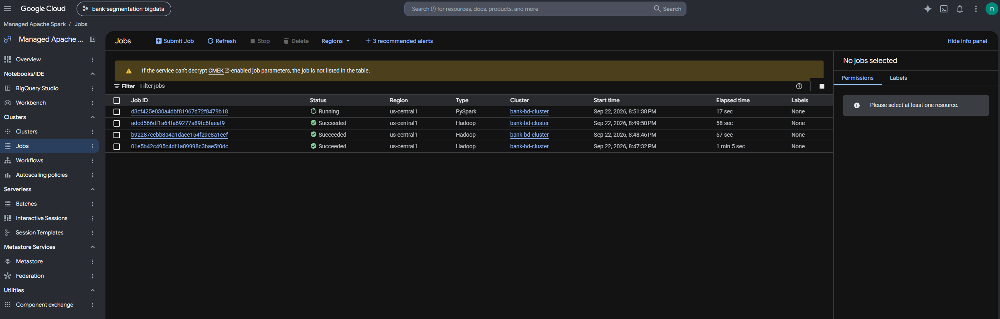

*Trabajos ejecutados en el clúster: los tres programas MapReduce (tipo
Hadoop) y una consulta PySpark sobre el dataset del bucket.*

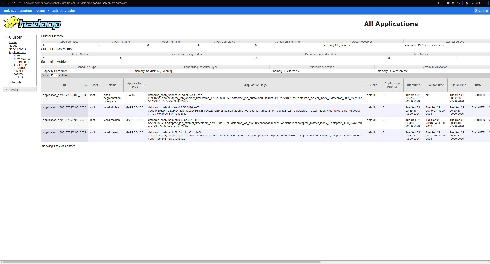

*Gestor de recursos YARN: las tres aplicaciones MapReduce (`word mean`,
`word median`, `word stddev`) y la consulta Spark
(`bank-segmentation-gcs-query`), sobre 2 nodos activos y un total de
19,20 GB de memoria y 6 vCores.*

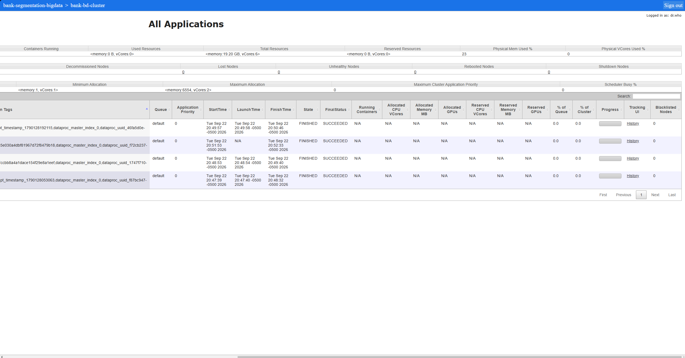

*La misma tabla desplazada hacia la derecha, mostrando las columnas de
tiempos de inicio y finalización y el estado final: las cuatro
aplicaciones terminaron con FinalStatus SUCCEEDED.*

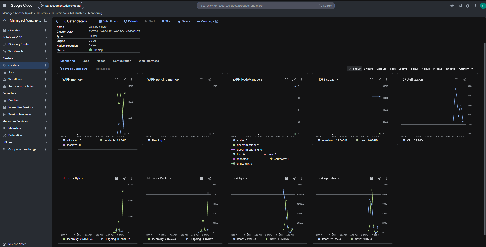

*Monitoreo del clúster durante la ejecución: 2 NodeManagers activos en
YARN, uso de HDFS, CPU y tráfico de red.*

### 4.1 WordMean

**Objetivo**: calcula la longitud promedio (en caracteres) de las palabras
del archivo de entrada, es decir, la longitud promedio de los nombres de
ciudad de los clientes.

**Comando**:
```
hadoop jar /usr/lib/hadoop-mapreduce/hadoop-mapreduce-examples.jar wordmean \
  /user/neo/input/locations.txt /user/neo/output/wordmean
```

**Resultado** (`hadoop fs -cat /user/neo/output/wordmean/part-r-*`):
```
count   1296123
length  8250551
```
Longitud promedio = 8.250.551 / 1.296.123 ≈ **6,37 caracteres**.

### 4.2 WordMedian

**Objetivo**: calcula la mediana de la longitud de las palabras, mediante
un histograma de longitud y frecuencia.

**Comando**:
```
hadoop jar /usr/lib/hadoop-mapreduce/hadoop-mapreduce-examples.jar wordmedian \
  /user/neo/input/locations.txt /user/neo/output/wordmedian
```

**Resultado** (histograma longitud → frecuencia, combinando las tres
particiones de salida):
```
1:10401  2:9769   3:97962  4:86371  5:295875 6:244228 7:199153
8:77717  9:198443 10:42360 11:13646 12:9000  13:7501  14:2175
15:662   16:257   17:87    18:466   19:3     20:9     21:21
22:4     25:4     29:9
```
El total de palabras (1.296.123) coincide con el valor de WordMean. La
posición central (palabra número 648.062) cae dentro de la longitud 6, por
lo que la **mediana es 6 caracteres**.

### 4.3 WordStandardDeviation

**Objetivo**: calcula la desviación estándar de la longitud de las
palabras, completando el perfil estadístico junto con WordMean y
WordMedian.

**Comando**:
```
hadoop jar /usr/lib/hadoop-mapreduce/hadoop-mapreduce-examples.jar wordstandarddeviation \
  /user/neo/input/locations.txt /user/neo/output/wordstddev
```

**Resultado**:
```
count   1296123
length  8250551
square  58602375
```
Varianza = (square/count) − promedio² = 45,21 − 40,52 ≈ 4,69
**Desviación estándar ≈ 2,17 caracteres**.

Los tres resultados son consistentes entre sí (promedio 6,37, mediana 6,
desviación estándar 2,17), describiendo una distribución razonable para la
longitud de nombres de ciudad.

## 5. Comandos de Infraestructura

```bash
# Creación del clúster
gcloud dataproc clusters create bank-bd-cluster \
  --region=us-central1 --zone=us-central1-a \
  --master-machine-type=e2-standard-4 --master-boot-disk-size=50GB \
  --num-workers=2 --worker-machine-type=e2-standard-2 --worker-boot-disk-size=50GB \
  --project=bank-segmentation-bigdata

# Ejecución de la comparativa en la nube (una sola máquina).
# BENCHMARK_MODE=read mide solo la lectura; sin esa variable se ejecuta la
# consulta completa. Cada combinación se repitió 5 veces.
export BENCHMARK_ENVIRONMENT=cloud
export BENCHMARK_DATA_PATH=gs://bank-segmentation-bigdata-data/raw/bank_transactions.csv
for rep in 1 2 3 4 5; do
  for lib in polars dask modin pyspark; do
    BENCHMARK_MODE=read python3 $lib/example_query.py
    python3 $lib/example_query.py
  done
done

# PySpark distribuido (YARN, integrado en Dataproc)
BENCHMARK_ENVIRONMENT=cloud_distributed BENCHMARK_SPARK_MASTER=yarn python3 pyspark/example_query.py

# Clúster Dask sobre los mismos nodos: scheduler en el maestro,
# procesos worker en cada nodo worker
dask scheduler --host 0.0.0.0                        # en el nodo maestro
dask worker tcp://<ip-maestro>:8786 --nworkers 2     # en cada nodo worker

# Dask y Modin distribuidos, conectados a ese clúster
export BENCHMARK_ENVIRONMENT=cloud_distributed
export BENCHMARK_DASK_SCHEDULER=tcp://<ip-maestro>:8786
python3 dask/example_query.py
python3 modin/example_query.py

# Eliminación del clúster
gcloud dataproc clusters delete bank-bd-cluster --region=us-central1 --quiet
```
